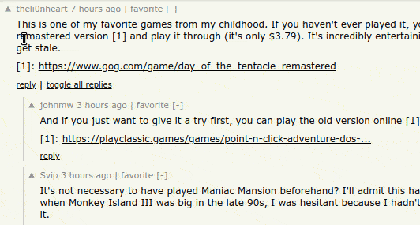
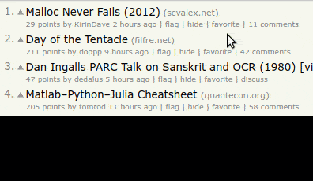
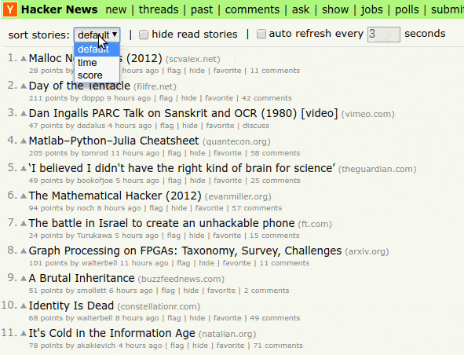
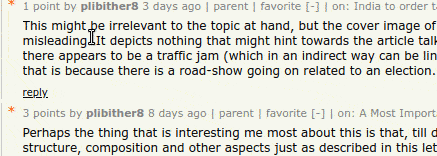
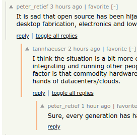

#  Refined Hacker News

[link-cws]: https://chrome.google.com/webstore/detail/gcibdgjaladjjloeocimnijdgopejkfk "Version published on Chrome Web Store"
[link-amo]: https://addons.mozilla.org/en-US/firefox/addon/refined-hacker-news/ "Version published on Mozilla Add-ons"

 
[][link-cws]
[][link-amo]

> ✨ Browser extension that adds useful features and tweaks a few stuff on [Hacker News](https://news.ycombinator.com) to make the experience better... without changing the look and feel.

The minimalist design of Hacker News is best at offering news the way we like it. Yet there are a few small interface tweaks and additional features that can drastically improve our experience while browsing through items and comments which this extension implements.

Hopefully, in due course, a few of these tweaks can be implemented by Hacker News themselves. You can help too by emailing [hn@ycombinator.com](mailto:hn@ycombinator.com)!

*Inspired by [Sindre Sorhus](https://github.com/sindresorhus)'s extension [Refined GitHub](https://github.com/sindresorhus/refined-github).*

## Contents

- [Contents](#contents)
- [Install](#install)
- [Highlights](#highlights)
	- [Added features](#added-features)
	- [UI tweaks](#ui-tweaks)
	- [More actions](#more-actions)
	- [More info at a glance](#more-info-at-a-glance)
	- [Miscellaneous](#miscellaneous)
	- [Keyboard bindings](#keyboard-bindings)
		- [On items and comments](#on-items-and-comments)
		- [On input fields](#on-input-fields)
	- [Abandoned features](#abandoned-features)
- [Customization and Options](#customization-and-options)
- [Contribute](#contribute)
- [Donate](#donate)
- [Extension Permissions](#extension-permissions)
- [License](#license)

## Install

- [**Chrome** extension][link-cws] [][link-cws]
- [**Firefox** add-on][link-amo] [][link-amo]
- **Opera** extension: Use [this Opera extension](https://addons.opera.com/en/extensions/details/download-chrome-extension-9/) to install the Chrome version.

## Highlights

<table>
	<tr>
		<th width="50%">
			Reply to comments without leaving page
		</th>
		<th width="50%">
			Navigate through items and comments using your keyboard
		</th>
	</tr>
	<tr><!-- Prevent zebra stripes --></tr>
	<tr>
		<td>
			

		</td>
		<td>
			

		</td>
	</tr>
</table>

<table>
	<tr>
		<th width="50%">
			Easily <i>favorite</i> items and comments
		</th>
		<th width="50%">
			Hide and sort stories, and auto-refresh the page from the options bar
		</th>
	</tr>
	<tr><!-- Prevent zebra stripes --></tr>
	<tr>
		<td>
			

		</td>
		<td>
			

		</td>
	</tr>
</table>

<table>
	<tr>
		<th width="50%">
			Show user or item information when hovering over the links
		</th>
		<th width="50%">
			Highlight new, unread comments on subsequent visits
		</th>
	</tr>
	<tr><!-- Prevent zebra stripes --></tr>
	<tr>
		<td>
			

		</td>
		<td>
			

		</td>
	</tr>
</table>

### Added features

- [**`reply-without-leaving-page`**](src/features/reply-without-leaving-page.js) Reply to a comment, edit and delete your comment just below the parent comment, without leaving the page.
- [**`auto-refresh`**](src/features/auto-refresh.js) *Options bar:* Auto-refresh stories on the page periodically, after a fixed interval, without reloading the page.
- [**`hide-read-stories`**](src/features/hide-read-stories.js) *Options bar:* Hide/show stories already opened by you.
- [**`sort-stories`**](src/features/sort-stories.js) *Options bar:* Sort stories basis of their score, age, or by their default rank.
- [**`fetch-submission-title-from-url`**](src/features/fetch-submission-title-from-url.js) When submitting an item, get the title of the page of the URL entered.
- [**`list-hn-polls-separately`**](src/features/list-hn-polls-separately.js) Show *HN Polls* on a separate page (like *Show HN*, *Ask HN*, etc). Linked on topbar: [https://news.ycombinator.com/#polls](https://news.ycombinator.com/#polls).
- [**`prefill-submit-title`**](src/features/prefill-submit-title.js) Prefill submission title field with "Show HN: " or "Ask HN: " when 'Submit' link is accessed/clicked from *Show HN* or *Ask HN* pages.
- [**`past-choose-date`**](src/features/past-choose-date.js) Choose a custom date in `/front` to go back to that date.

### UI tweaks

- [**`change-dead-comments-color`**](src/features/change-dead-comments-color.js) If "showdead" is enabled in user settings, color of dead comments changes to light-red (`#d89899`) instead of the barely visible light-grey (`#dddddd`).
- [**`comments-ui-tweaks`**](src/features/comments-ui-tweaks.js) Tweaks include:
  - Add border to indentation to make to show indent separation between comments
  - Custom indent-width (default is 40px), which can be set using the extension popup
  - Highlight item's original poster, displayed as `[op]` next to username
- [**`highlight-unread-comments`**](src/features/highlight-unread-comments.js) Highlight new and unread comments after your second and subsequent visits to the comments page of an item. Data resets after three days.
- [**`linkify-user-about`**](src/features/linkify-user-about.js) Linkify all links and emails IDs that are on the "about" of the user's profile.

### More actions

- [**`key-bindings-on-items`**](src/features/key-bindings-on-items.js) Enable key bindings on items and comments to improve navigation and item/comment-related actions. [Go to mappings](#on-items-and-comments).
- [**`key-bindings-on-input-fields`**](src/features/key-bindings-on-input-fields.js) Enable key bindings/shortcuts on input fields. [Go to mappings](#on-input-fields).
- [**`more-accessible-favorite`**](src/features/more-accessible-favorite.js) Add a 'favorite' button next to items and comments to quickly *favorite* them. Go to `https://news.ycombinator.com/favorites?id=<your-username>` to view favorite-d items.
- [**`click-comment-indent-to-toggle`**](src/features/click-comment-indent-to-toggle.js) Click indentation of the comment (on the left of it) to toggle (show/hide) that comment.
- [**`click-rank-to-vote-unvote`**](src/features/click-rank-to-vote-unvote.js) Increase hit-area of upvote button by clicking the rank number of the item to upvote it too.
- [**`open-story-links-in-new-tab`**](src/features/open-story-links-in-new-tab.js) Open items in a new tab, instead of the same tab.
- [**`preview-and-set-top-bar-color`**](src/features/preview-and-set-top-bar-color.js) Quickly "test" topbar colors and set them on [https://news.ycombinator.com/topcolors](https://news.ycombinator.com/topcolors). *Note: you must have 250+ karma to set a custom topcolor*.
- [**`toggle-all-comments-and-replies`**](src/features/toggle-all-comments-and-replies.js) Clickable button to toggle all comments on the page, or all replies to a certain comment.

### More info at a glance

- [**`load-more-links-in-navbar`**](src/features/load-more-links-in-navbar.js) Click "load more" on the topbar/nav bar to show more links.
- [**`profile-links-dropdown`**](src/features/profile-links-dropdown.js) Show profile-specific pages in a dropdown when clicking your username on the top-right of the page, instead of directly opening the the profile page.
- [**`show-item-info-on-hover`**](src/features/show-item-info-on-hover.js) Hover over a Hacker News item link in the comments to quickly display the item's details.
- [**`show-similar-submissions`**](src/features/show-similar-submissions.js) List all HN submissions that are duplicates/have been posted before with the same URL, at the bottom of the comments.
- [**`show-top-leaders-karma`**](src/features/show-top-leaders-karma.js) Load and show karma of the top-ten leaders on [HN's leaderboard](https://news.ycombinator.com/leaders) (not shown by default).
- [**`show-user-info-on-hover`**](src/features/show-user-info-on-hover.js) Hover over a Hacker News user link next to item or in the comments to quickly display the users's details.

### Miscellaneous

- [**`input-field-tweaks`**](src/features/input-field-tweaks.js) Tweaks include:
  - Show how many characters are left in the 'title' field when submitting an item.
  - Increase width of 'title' field dynamically.
  - Increase height of any textareas (even those that are dynamically created), dynamically.
- [**`on-link-focus-comment`**](src/features/on-link-focus-comment.js) Navigate to that specific comment when clicking the 'on: ' link.

---

### Keyboard bindings

#### On items and comments

*On items/stories:*

| Key-binding                                                | Action                                                                |
|------------------------------------------------------------|-----------------------------------------------------------------------|
| <kbd>J</kbd>                                               | Next item (down)                                                      |
| <kbd>K</kbd>                                               | Previous item (up)                                                    |
| <kbd>Enter</kbd>   <kbd>Ctrl/Cmd</kbd>+<kbd>Enter</kbd> | Open link and focus tab   Open link in the background              |
| <kbd>Esc</kbd>                                             | Un-highlight item                                                     |
| <kbd>U</kbd>                                               | Upvote item                                                           |
| <kbd>F</kbd>                                               | Favorite item                                                         |
| <kbd>C</kbd>   <kbd>Ctrl/Cmd</kbd>+<kbd>C</kbd>         | Open item's comments on same tab   Open item's comments on new tab |
| <kbd>Shift</kbd>+<kbd>X</kbd>                              | Flag/unflag item                                                      |
| <kbd>Shift</kbd>+<kbd>H</kbd>                              | Hide item                                                             |

*On comments:*

| Key-binding                                     | Action                                                                                |
|-------------------------------------------------|---------------------------------------------------------------------------------------|
| <kbd>J</kbd>   <kbd>Shift</kbd>+<kbd>J</kbd> | Next comment (down)   Next comment with same indentation and parent                |
| <kbd>K</kbd>   <kbd>Shift</kbd>+<kbd>K</kbd> | Previous comment (down)   Previous comment with same indentation and parent        |
| <kbd>Enter</kbd>                                | Toggle comment                                                                        |
| <kbd>Esc</kbd>                                  | Un-highlight comment                                                                  |
| <kbd>U</kbd>                                    | Upvote comment                                                                        |
| <kbd>R</kbd>                                    | Reply to comment                                                                      |
| <kbd>F</kbd>                                    | Favorite comment                                                                      |
| <kbd>0</kbd> to <kbd>9</kbd>                    | Open numbered/index reference link in the comment   Eg: `[1] https://mihir.ch ...` |

#### On input fields

| Key-binding                          | Action                                                       |
|--------------------------------------|--------------------------------------------------------------|
| <kbd>Ctrl/Cmd</kbd>+<kbd>Enter</kbd> | Submit form                                                  |
| <kbd>Ctrl/Cmd</kbd>+<kbd>I</kbd>     | Italicise selected portion (wrap selected text in asterisks) |

---

### Abandoned features

- `blur-story-scores`
- `custom-font-face`
- `hide-bad-words`
- `load-more-stories`
- `scale-font-size`
- `show-karma-left`

## Customization and Options

Extension options can be found in the extension's popup. There, you can

- specify which features you want to disable by entering features' IDs (listed above), preferably listed on new lines
- specify custom CSS, which is useful to override CSS implemented by this extension, or any other UI tweaks you prefer.

## Contribute

Issues and feature requests can be created on the [issues page](https://github.com/plibither8/refined-hacker-news/issues).

For development contribution, please refer to the [contribution guide](./CONTRIBUTING.md).

## Donate

Refined Hacker News was made by me during my study-breaks and free time. If you like and have enjoyed it, please consider donating a small amount (any amount will be really appreciated!) to support and sustain its development. Thank you!

## Extension Permissions

No data is ever uploaded to a remote server, or is sent anywhere else. All data that is used by this extension is stored locally.

**`storage`** Required to save extension options in `sync` storage area so that your options are synced across devices. Also used to save other data such as list of read comments (`highlight-unread-comments`) locally.

**`history`** Required for `hide-read-stories` feature. The feature needs to check whether the story has been visited by you in the past, that is, whether that story is in your history.

**`tabs`** Required to open a link in a new tab, but in the background. Also required to send and receive data between the extension popup, background scripts and the active Hacker News tabs.

**`*://news.ycombinator.com/*`** Required to fetch subpages, submit forms, inline replies, etc.

**`*://hacker-news.firebaseio.com/v0/*`** Hacker News API - required to fetch `item` and `user` details.

**`*://textance.herokuapp.com/*`** Required by the `fetch-submission-title-from-url` feature to fetch the title.

**`*://hn.algolia.com/*`** Required by `show-simillar-submission` and `list-hn-polls-separately` features to get filtered search results.

## License

[MIT](LICENSE)
