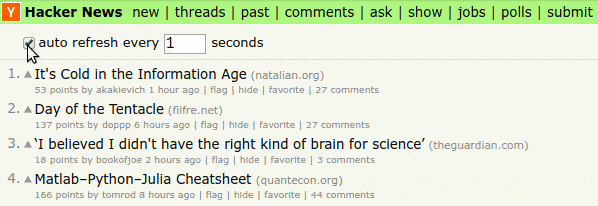
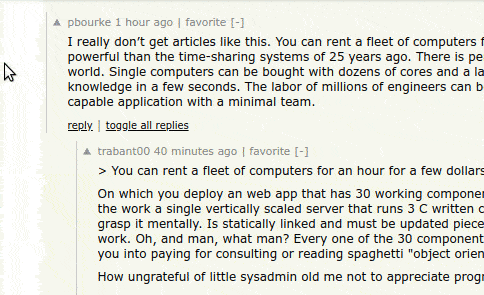

# Refined Hacker News

> ✨ Hacker News, but refined.

## About

This is a small browser that tweaks a few stuff on Hacker News to make the experience better, while keeping the core design principles in place.

Inspired by [Sindre Sorhus](https://github.com/sindresorhus)'s extension [Refined GitHub](https://github.com/sindresorhus/refined-github).

## Features

	<strong><code><a href="src/features/auto-refresh.js">auto-refresh</a></code></strong>

Refresh the news feed periodically, after a set interval (in seconds), without refreshing the entire page.

	<strong><code><a href="src/features/change-dead-comments-color.js">change-dead-comments-color</a></code></strong>

If "showdead" has been enabled in your profile settings, the color of dead comments will be light-red (`#d89899`) instead of the barely visible light grey.

	<strong><code><a href="src/features/click-comment-indent-to-toggle.js">click-comment-indent-to-toggle</a></code></strong>

Click the indented area to the left of the comment to quickly toggle it.

	<strong><code><a href="src/features/click-rank-to-vote-unvote.js">click-rank-to-vote-unvote</a></code></strong>

Increase the hit-area of the "upvote" button by clicking the rank to upvote/un-vote an item.

	<strong><code><a href="src/features/comments-ui-tweaks.js">comments-ui-tweaks</a></code></strong>

	<strong><code><a href="src/features/fetch-submission-title-from-url.js">fetch-submission-title-from-url</a></code></strong>

	<strong><code><a href="src/features/hide-read-stories.js">hide-read-stories</a></code></strong>

	<strong><code><a href="src/features/highlight-unread-comments.js">highlight-unread-comments</a></code></strong>

	<strong><code><a href="src/features/input-field-tweaks.js">input-field-tweaks</a></code></strong>

	<strong><code><a href="src/features/key-bindings-on-input-fields.js">key-bindings-on-input-fields</a></code></strong>

	<strong><code><a href="src/features/key-bindings-on-items.js">key-bindings-on-items</a></code></strong>

	<strong><code><a href="src/features/linkify-user-about.js">linkify-user-about</a></code></strong>

	<strong><code><a href="src/features/list-hn-polls-separately.js">list-hn-polls-separately</a></code></strong>

	<strong><code><a href="src/features/load-more-links-in-navbar.js">load-more-links-in-navbar</a></code></strong>

	<strong><code><a href="src/features/more-accessible-favorite.js">more-accessible-favorite</a></code></strong>

	<strong><code><a href="src/features/on-link-focus-comment.js">on-link-focus-comment</a></code></strong>

	<strong><code><a href="src/features/open-story-links-in-new-tab.js">open-story-links-in-new-tab</a></code></strong>

	<strong><code><a href="src/features/past-choose-date.js">past-choose-date</a></code></strong>

	<strong><code><a href="src/features/prefill-submit-title.js">prefill-submit-title</a></code></strong>

	<strong><code><a href="src/features/preview-and-set-top-bar-color.js">preview-and-set-top-bar-color</a></code></strong>

	<strong><code><a href="src/features/profile-links-dropdown.js">profile-links-dropdown</a></code></strong>

	<strong><code><a href="src/features/reply-without-leaving-page.js">reply-without-leaving-page</a></code></strong>

	<strong><code><a href="src/features/show-item-info-on-hover.js">show-item-info-on-hover</a></code></strong>

	<strong><code><a href="src/features/show-similar-submissions.js">show-similar-submissions</a></code></strong>

	<strong><code><a href="src/features/show-top-leaders-karma.js">show-top-leaders-karma</a></code></strong>

	<strong><code><a href="src/features/show-user-info-on-hover.js">show-user-info-on-hover</a></code></strong>

	<strong><code><a href="src/features/sort-stories.js">sort-stories</a></code></strong>

	<strong><code><a href="src/features/toggle-all-comments-and-replies.js">toggle-all-comments-and-replies</a></code></strong>

### Abandoned

- `blur-story-scores`
- `custom-font-face`
- `hide-bad-words`
- `load-more-stories`
- `scale-font-size`
- `show-karma-left`
